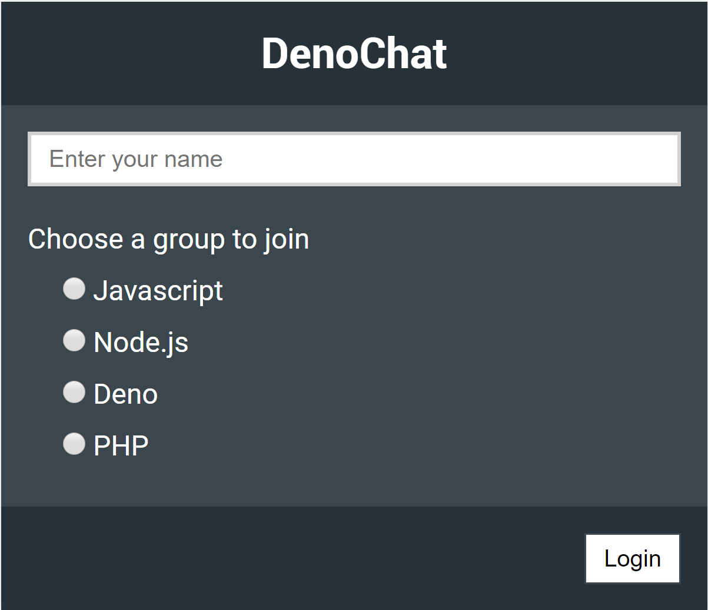
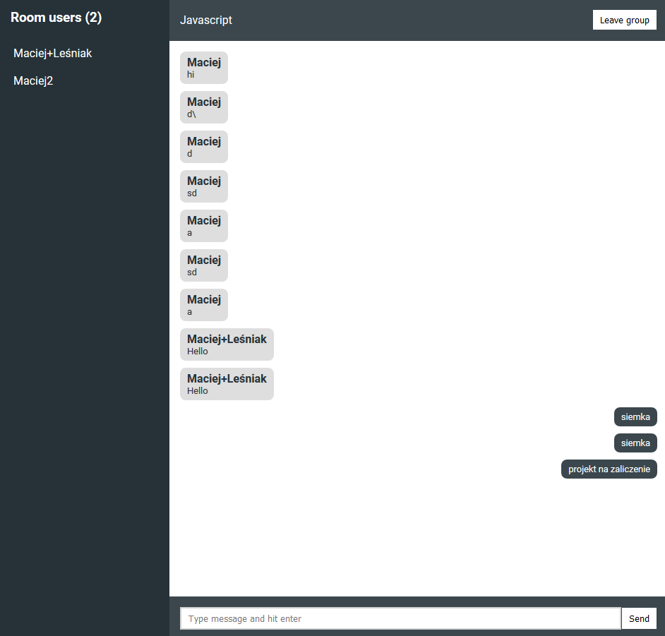

# deno-realtime-chat-app

!

## INSTALLATION
You need to have [Deno installed](https://deno.land/#installation) in order to run this app locally

1. Clone the repository
1. Go to the project root using terminal
1. Run deno run --allow-net server.js
1. Open public/chat.html in browser
1. That's all.
